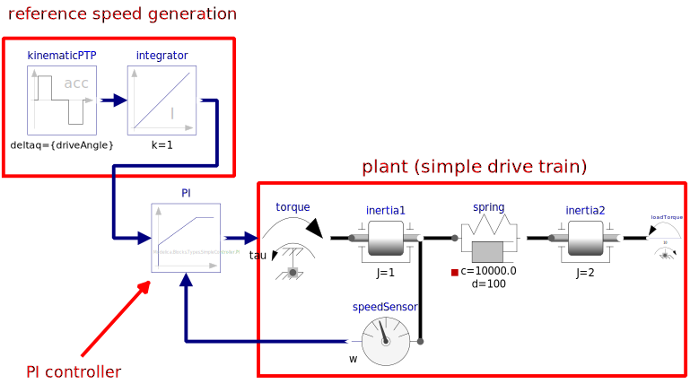

```yaml script=scriptloader
- lib/tinytimer.js
```

```yaml script=dataloader
xml: Modelica.Blocks.Examples.PID_Controller_init.xml 
```

<style media="screen" type="text/css">
label {font-weight:normal; size: 0.9em}
</style>


<h1>OpenModelica simulation example</h1>
<h2>Modelica.Blocks.Examples.PID_Controller</h1></h2>

<br/>
<br/>

<div id="status" style="text-align:center"><span id="statustext">
Simulation loading</span>. &nbsp Time: <span id="statustimer"> </span></div>

<br/>

<div class = "row">
<div class = "col-md-5">

<br/>
<br/>
<br/>
<br/>
<br/>
<br/>


```yaml jquery=dform
class : form-horizontal
col1class : col-sm-8
col2class : col-sm-4
html: 
  - name: stopTime
    type: number
    bs3caption: Stop time, sec
    value: 4.0
  - name: intervals
    type: number
    bs3caption: Output intervals
    value: 500
  - name: tolerance
    type: number
    bs3caption: Tolerance
    value: 0.0000001
  - name: k 
    type: number
    bs3caption: Controller gain
    value: 100
  - name: Ti 
    type: number
    bs3caption: Ti, integrator block, sec
    value: 0.1
  - name: Td 
    type: number
    bs3caption: Td, derivative block, sec
    value: 0.1
```

```js
if (typeof(isRunning) == "undefined") isRunning = false

if (typeof(timer) != "undefined") {clearInterval(timer.interval); timer = null};
$xml = $(xml)

// Set the default simulation parameters
defex = $xml.find("DefaultExperiment")
defex.attr("stopTime", stopTime)
defex.attr("stepSize", +stopTime / intervals)
defex.attr("tolerance", tolerance)

// Set some model parameters
$xml.find("ScalarVariable[name = 'PI.k']").find("Real").attr("start", k)
$xml.find("ScalarVariable[name = 'PI.Ti']").find("Real").attr("start", Ti)
$xml.find("ScalarVariable[name = 'PI.Td']").find("Real").attr("start", Td)

// Write out the initialization file
xmlstring = new XMLSerializer().serializeToString(xml)

$("#statustext").html('Simulation running')
$("#statustimer").html("");
$('#statustimer').tinyTimer({ from: Date.now() });

timer = $("#statustimer").data("tinyTimer")

// Start the simulation!
basename = "Modelica.Blocks.Examples.PID_Controller"

if (typeof(wworker) != "undefined" && isRunning) wworker.terminate() 
if (typeof(wworker) == "undefined" || isRunning) wworker = new Worker(basename + ".js")
isRunning = true

wworker.postMessage({basename: basename, xmlstring: xmlstring})
wworker.addEventListener('error', function(event) {
});


```


```js
// read the csv file with the simulation results

wworker.addEventListener("message", function(e) {
    $("#statustext").html(e.data.status)
    timer.stop();
    isRunning = false
    x = $.csv.toArrays(e.data.csv, {onParseValue: $.csv.hooks.castToScalar})
    
    // `header` has the column names. The first is the time, and the rest
    // of the columns are the variables.
    header = x.slice(0,1)[0]
    
    // Select graph variables with a select box based on the header values
    if (typeof(graphvar) == "undefined") graphvar = header[1];
    if (typeof(graphvarX) == "undefined") graphvarX = header[0];
    
    var jsonform = {
      html: {
        type: "select",
        bs3caption: "Plot variable",
        name: "graphvar",
        selectvalue: graphvar,
        choices: header
    }};
    var jsonformX = {
      html: {
        type: "select",
        bs3caption: "",
        name: "graphvarX",
        selectvalue: graphvarX,
        choices: header
    }};
    updatefun = function (evt) {
        calculate_forms();
        $("#plotdiv").calculate();
    }
    
    
    $("#yaxisform").html("");
    $("#yaxisform").dform(jsonform);
    $("#yaxisform").change(updatefun);
    $("#xaxisform").html("");
    $("#xaxisform").dform(jsonformX);
    $("#xaxisform").change(updatefun);
    $("#plotdiv").calculate();
    
}, false);

```

</div>


<div class = "col-md-7">

<!-- Nav tabs -->
<ul class="nav nav-tabs" id="mytab">
  <li class="active"><a href="#model" data-toggle="tab">Model</a></li>
  <li><a href="#results" data-toggle="tab">Results</a></li>
</ul>

<!-- Tab panes -->
<div class="tab-content">
  <!-- Model pane -->
  <div class="tab-pane active" id="model">



  </div>

  <!-- Results pane -->
  <div class="tab-pane" id="results">

</br>

<div id="yaxisform" style="width:15em; position:relative"> </div>

```js id=plotdiv
if (typeof(header) != "undefined") {
    $("#mytab a:last").tab("show"); // Select last tab
    yidx = header.indexOf(graphvar);
    xidx = header.indexOf(graphvarX);
    // pick out the column to plot
    series = x.slice(1).map(function(x) {return [x[xidx], x[yidx]];});
    plot([series]);
}
```

<div id="xaxisform" class="center-block" style="text-align:center; width:15em; position:relative"> </div>


  </div>
</div>

</div>
</div>

## Demonstrates the usage of a Continuous.LimPID controller

This is a simple drive train controlled by a PID controller:

- The two blocks "kinematic_PTP" and "integrator" are used to generate the reference speed (= constant acceleration phase, constant speed phase, constant deceleration phase until inertia is at rest). To check whether the system starts in steady state, the reference speed is zero until time = 0.5 s and then follows the sketched trajectory.
- The block "PI" is an instance of "Blocks.Continuous.LimPID" which is a PID controller where several practical important aspects, such as anti-windup-compensation has been added. In this case, the control block is used as PI controller.
- The output of the controller is a torque that drives a motor inertia "inertia1". Via a compliant spring/damper component, the load inertia "inertia2" is attached. A constant external torque of 10 Nm is acting on the load inertia.

The PI controller settings included "limitAtInit=false", in order that the controller output limits of 12 Nm are removed from the initialization problem.

The PI controller is initialized in steady state (initType=SteadyState) and the drive shall also be initialized in steady state. However, it is not possible to initialize "inertia1" in SteadyState, because "der(inertia1.phi)=inertia1.w=0" is an input to the PI controller that defines that the derivative of the integrator state is zero (= the same condition that was already defined by option SteadyState of the PI controller). Furthermore, one initial condition is missing, because the absolute position of inertia1 or inertia2 is not defined. The solution shown in this examples is to initialize the angle and the angular acceleration of "inertia1".


## Comments

This simulation model is from a [Modelica](http://modelica.org) model.
Modelica is a language for simulating electrical, thermal, and
mechanical, systems. [OpenModelica](http://openmodelica.org) was used
to compile this model to C. Then, [Emscripten](http://emscripten.org/)
was used to compile the C code to JavaScript.

The JavaScript code for the model is almost 2 MB, so that's why the
page loading takes so long. Once loaded, the simulation runs pretty
quickly.

For more information on compiling OpenModelica to JavaScript, see
[here](https://github.com/tshort/openmodelica-javascript).

The user interface was created in
[mdpad](http://tshort.github.io/mdpad/). See
[Modelica.Blocks.Examples.PID_Controller.md](Modelica.Blocks.Examples.PID_Controller.md) for the Markdown code
for this page.

This should work in both Firefox and Chrome. It doesn't work in
Internet Explorer. 
