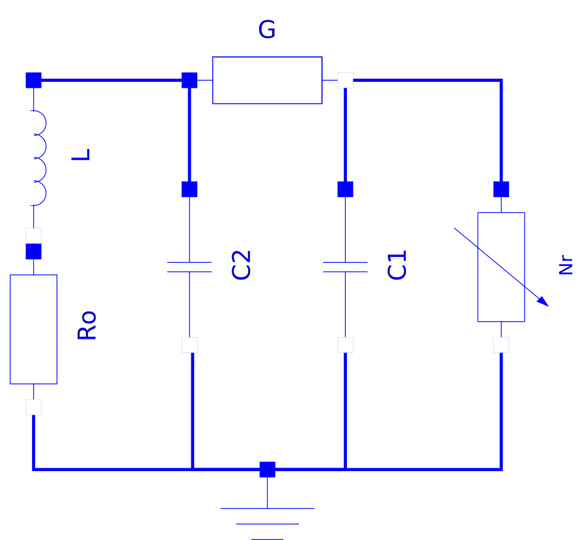

```yaml script=scriptloader
- lib/tinytimer.js
```

```yaml script=dataloader
xml: Modelica.Electrical.Analog.Examples.ChuaCircuit_init.xml 
```

<style media="screen" type="text/css">
label {font-weight:normal; size: 0.9em}
</style>


<h1>OpenModelica simulation example</h1>
<h2>Modelica.Electrical.Analog.Examples.ChuaCircuit</h1></h2>

<br/>
<br/>

<div id="status" style="text-align:center"><span id="statustext">
Simulation loading</span>. &nbsp Time: <span id="statustimer"> </span></div>

<br/>

<div class = "row">
<div class = "col-md-4">

<br/>
<br/>
<br/>
<br/>
<br/>
<br/>


```yaml jquery=dform
class : form-horizontal
col1class : col-sm-7
col2class : col-sm-5
html: 
  - name: stopTime
    type: number
    bs3caption: Stop time, sec
    value: 10000.0
  - name: intervals
    type: number
    bs3caption: Output intervals
    value: 500
  - name: tolerance
    type: number
    bs3caption: Tolerance
    value: 0.0001
  - name: L
    type: number
    bs3caption: L, henries
    value: 18.0
  - name: C1
    type: number
    bs3caption: C1, farads
    value: 10.0
  - name: C2
    type: number
    bs3caption: C2, farads
    value: 100.0
```

```js
if (typeof(isRunning) == "undefined") isRunning = false

if (typeof(timer) != "undefined") {clearInterval(timer.interval); timer = null};
$xml = $(xml)

// Set the default simulation parameters
defex = $xml.find("DefaultExperiment")
defex.attr("stopTime", stopTime)
defex.attr("stepSize", +stopTime / intervals)
defex.attr("tolerance", tolerance)

// Set some model parameters
$xml.find("ScalarVariable[name = 'L.L']").find("Real").attr("start", L)
$xml.find("ScalarVariable[name = 'C1.C']").find("Real").attr("start", C1)
$xml.find("ScalarVariable[name = 'C2.C']").find("Real").attr("start", C2)

// Write out the initialization file
xmlstring = new XMLSerializer().serializeToString(xml)

$("#statustext").html('Simulation running')
$("#statustimer").html("");
$('#statustimer').tinyTimer({ from: Date.now() });

timer = $("#statustimer").data("tinyTimer")

// Start the simulation!
basename = "Modelica.Electrical.Analog.Examples.ChuaCircuit"

if (typeof(wworker) != "undefined" && isRunning) wworker.terminate() 
if (typeof(wworker) == "undefined" || isRunning) wworker = new Worker(basename + ".js")
isRunning = true

wworker.postMessage({basename: basename, xmlstring: xmlstring})
wworker.addEventListener('error', function(event) {
});


```


```js
// read the csv file with the simulation results

wworker.addEventListener("message", function(e) {
    $("#statustext").html(e.data.status)
    timer.stop();
    isRunning = false
    x = $.csv.toArrays(e.data.csv, {onParseValue: $.csv.hooks.castToScalar})
    
    // `header` has the column names. The first is the time, and the rest
    // of the columns are the variables.
    header = x.slice(0,1)[0]
    
    // Select graph variables with a select box based on the header values
    if (typeof(graphvar) == "undefined") graphvar = header[1];
    if (typeof(graphvarX) == "undefined") graphvarX = header[0];
    
    var jsonform = {
      html: {
        type: "select",
        bs3caption: "Plot variable",
        name: "graphvar",
        selectvalue: graphvar,
        choices: header
    }};
    var jsonformX = {
      html: {
        type: "select",
        bs3caption: "",
        name: "graphvarX",
        selectvalue: graphvarX,
        choices: header
    }};
    updatefun = function (evt) {
        calculate_forms();
        $("#plotdiv").calculate();
    }
    
    
    $("#yaxisform").html("");
    $("#yaxisform").dform(jsonform);
    $("#yaxisform").change(updatefun);
    $("#xaxisform").html("");
    $("#xaxisform").dform(jsonformX);
    $("#xaxisform").change(updatefun);
    $("#plotdiv").calculate();
    
}, false);

```

</div>


<div class = "col-md-1">
</div>

<div class = "col-md-7">

<!-- Nav tabs -->
<ul class="nav nav-tabs" id="mytab">
  <li class="active"><a href="#model" data-toggle="tab">Model</a></li>
  <li><a href="#results" data-toggle="tab">Results</a></li>
</ul>

<!-- Tab panes -->
<div class="tab-content">
  <!-- Model pane -->
  <div class="tab-pane active" id="model">



  </div>

  <!-- Results pane -->
  <div class="tab-pane" id="results">

</br>

<div id="yaxisform" style="width:15em; position:relative"> </div>

```js id=plotdiv
if (typeof(header) != "undefined") {
    $("#mytab a:last").tab("show"); // Select last tab
    yidx = header.indexOf(graphvar);
    xidx = header.indexOf(graphvarX);
    // pick out the column to plot
    series = x.slice(1).map(function(x) {return [x[xidx], x[yidx]];});
    plot([series]);
}
```

<div id="xaxisform" class="center-block" style="text-align:center; width:15em; position:relative"> </div>


  </div>
</div>

</div>
</div>


## Information

Chua's circuit is a simple nonlinear circuit which shows
chaotic behaviour. The circuit consists of linear basic elements
(capacitors, resistor, conductor, inductor), and one nonlinear
element, which is called Chua's diode. The chaotic behaviour is
simulated.

The simulation end time should be set to 5e4. To see the chaotic
behaviour, plot `C1.v` against `C2.v`.

Kennedy, M.P.: Three Steps to Chaos - Part I: Evolution. *IEEE
Transactions on CAS*. I 40 (1993)10, 640-656.

## Comments

This simulation model is from a [Modelica](http://modelica.org) model.
Modelica is a language for simulating electrical, thermal, and
mechanical, systems. [OpenModelica](http://openmodelica.org) was used
to compile this model to C. Then, [Emscripten](http://emscripten.org/)
was used to compile the C code to JavaScript.

The JavaScript code for the model is almost 2 MB, so that's why the
page loading takes so long. Once loaded, the simulation runs pretty
quickly.

For more information on compiling OpenModelica to JavaScript, see
[here](https://github.com/tshort/openmodelica-javascript).

The user interface was created in
[mdpad](http://tshort.github.io/mdpad/). See
[chua.md](http://tshort.github.io/mdpad/chua.md) for the Markdown code
for this page.

This should work in both Firefox and Chrome. It doesn't work in
Internet Explorer. Sometimes, the simulation fails with "out of
memory" in Firefox 23 in Windows. I haven't seen that with Firefox 20
on Linux.
